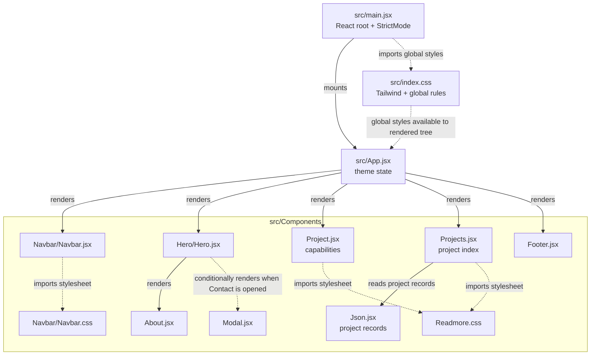
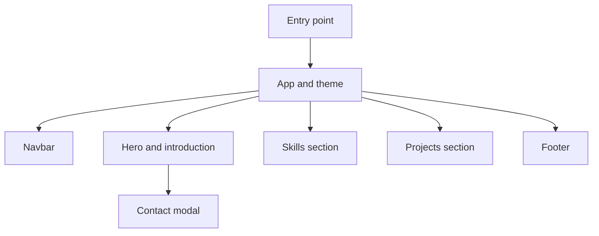

# React portfolio architecture

## Component and stylesheet graph

Solid arrows show rendering or data flow; dashed arrows show stylesheet or global-style dependencies.

## Direct component dependencies

| File | Component/data dependencies | CSS |
| --- | --- | --- |
| `src/main.jsx` | Renders `App` inside React `StrictMode` | Imports `src/index.css` |
| `src/App.jsx` | `Navbar`, `Hero`, `Project`, `Projects`, `Footer` | Uses Tailwind utility classes; global Tailwind setup comes from `src/index.css` |
| `src/Components/Navbar/Navbar.jsx` | None | Imports `src/Components/Navbar/Navbar.css`; also uses Tailwind utility classes |
| `src/Components/Hero/Hero.jsx` | `About`; conditionally renders `Modal` | Uses Tailwind utility classes |
| `src/Components/About.jsx` | None | Uses Tailwind utility classes |
| `src/Components/Modal.jsx` | None | Uses Tailwind utility classes |
| `src/Components/Project.jsx` | None | Imports `src/Components/Readmore.css`; also uses Tailwind utility classes |
| `src/Components/Projects.jsx` | Reads records from `src/Components/Json.jsx` | Imports `src/Components/Readmore.css`; also uses Tailwind utility classes |
| `src/Components/Footer.jsx` | None | Uses Tailwind utility classes |
| `src/Components/Json.jsx` | Project records and image assets; not a rendered component | None |

`src/index.css` is the global entry point for Tailwind and shared CSS rules. `main.jsx` also imports `createBrowserRouter`, but does not use it; the current app is mounted directly without a router.

## Simplified overview

## How to explain this in an interview

### 30-second overview

This is a single-page developer portfolio built with React and Vite. The app entry point mounts a root component, which composes the page from focused sections: navigation, an introduction, skills, projects, and a footer. Theme state is owned by the root and passed to the navigation, and the hero opens a contact modal. Tailwind handles most styling, with a small amount of CSS for shared effects and component-specific styles.

### Walk through the flow

- The browser loads the Vite-built app, and the entry point mounts the React root in strict mode.
- The root `App` component owns the light/dark theme state and lays out the page sections.
- The navigation receives the theme and its setter, so the user can switch the page theme.
- The hero introduces the developer, composes the `About` component, and opens the contact modal on demand.
- Skills and project sections render their respective content; project cards use records from a separate data module, followed by the footer.

### Tech stack and choices

- **React:** Builds the interface from reusable components and keeps interactive state, such as the theme and modal visibility, close to the parts that use it.
- **Vite:** Provides the development server and production build workflow with quick startup and feedback during frontend development.
- **Tailwind CSS:** Makes responsive styling and visual iteration convenient through utility classes in the markup; regular CSS remains available for shared rules and specific effects.

### Likely interview questions

1. **How is the page structured?**
   `App` composes the main sections, while each section is implemented as a focused component.

2. **Where does the theme state live, and how is it changed?**
   `App` owns the theme state and passes the current value and setter to `Navbar`, which toggles between light and dark.

3. **How are project cards populated?**
   `Projects` reads an array of project records from `Json.jsx` and maps over it to render the cards.

4. **How does the contact interaction work?**
   The hero tracks whether the contact modal is open and conditionally renders `Modal`; the modal handles its form state and submission.

5. **Why use both Tailwind and regular CSS?**
   Tailwind covers most layout and responsive styling directly in components, while regular CSS provides a place for shared or custom rules that are clearer outside utility classes.
