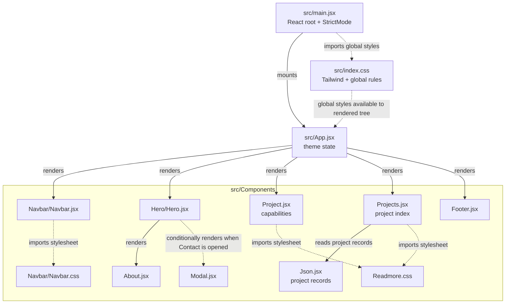

# React portfolio architecture

## Component and stylesheet graph

Solid arrows show rendering or data flow; dashed arrows show stylesheet or global-style dependencies.

## Direct component dependencies

| File | Component/data dependencies | CSS |
| --- | --- | --- |
| `src/main.jsx` | Renders `App` inside React `StrictMode` | Imports `src/index.css` |
| `src/App.jsx` | `Navbar`, `Hero`, `Project`, `Projects`, `Footer` | Uses Tailwind utility classes; global Tailwind setup comes from `src/index.css` |
| `src/Components/Navbar/Navbar.jsx` | None | Imports `src/Components/Navbar/Navbar.css`; also uses Tailwind utility classes |
| `src/Components/Hero/Hero.jsx` | `About`; conditionally renders `Modal` | Uses Tailwind utility classes |
| `src/Components/About.jsx` | None | Uses Tailwind utility classes |
| `src/Components/Modal.jsx` | None | Uses Tailwind utility classes |
| `src/Components/Project.jsx` | None | Imports `src/Components/Readmore.css`; also uses Tailwind utility classes |
| `src/Components/Projects.jsx` | Reads records from `src/Components/Json.jsx` | Imports `src/Components/Readmore.css`; also uses Tailwind utility classes |
| `src/Components/Footer.jsx` | None | Uses Tailwind utility classes |
| `src/Components/Json.jsx` | Project records and image assets; not a rendered component | None |

`src/index.css` is the global entry point for Tailwind and shared CSS rules. `main.jsx` also imports `createBrowserRouter`, but does not use it; the current app is mounted directly without a router.
